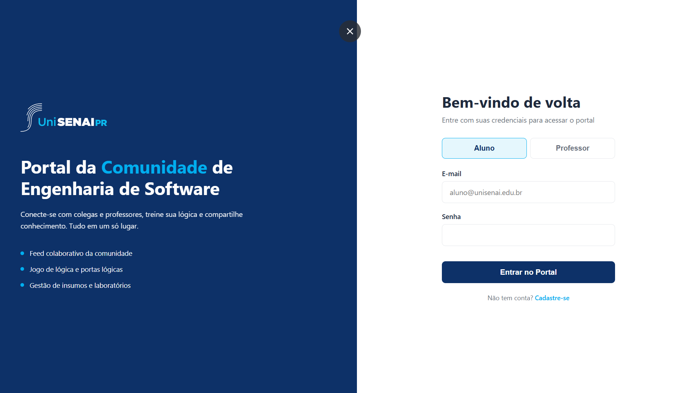
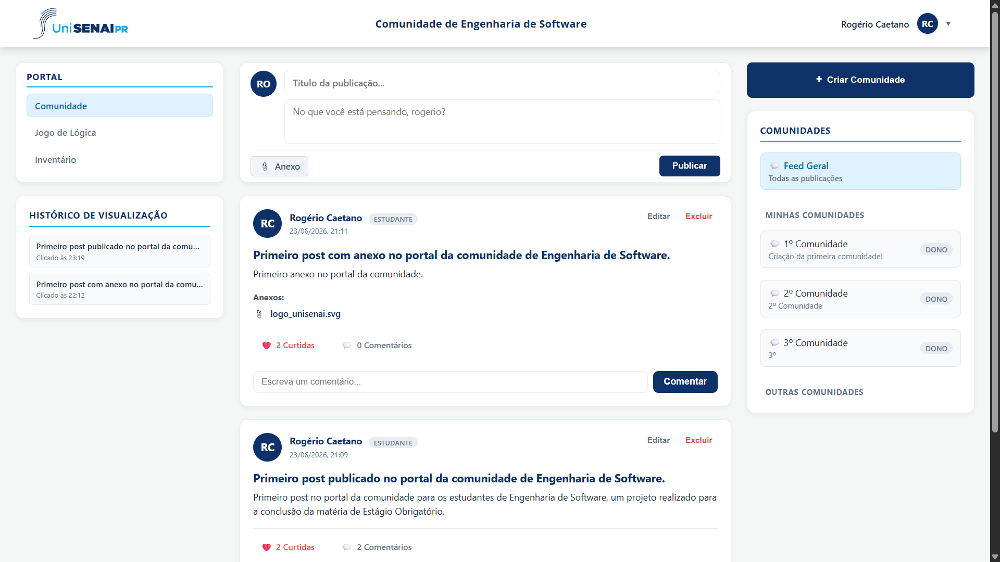
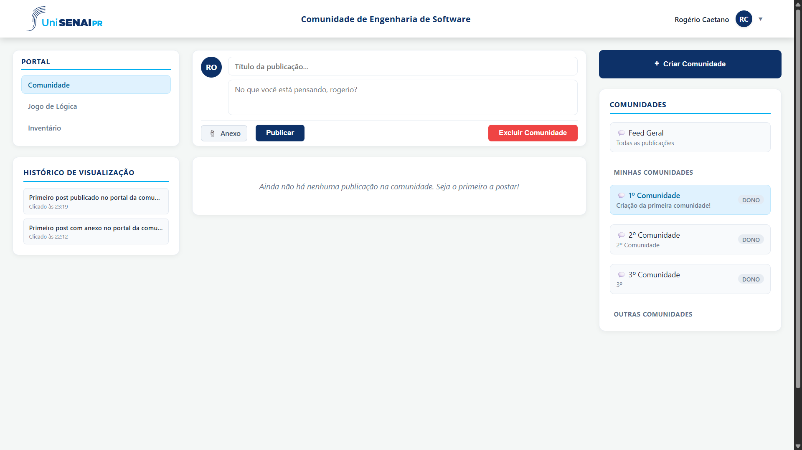
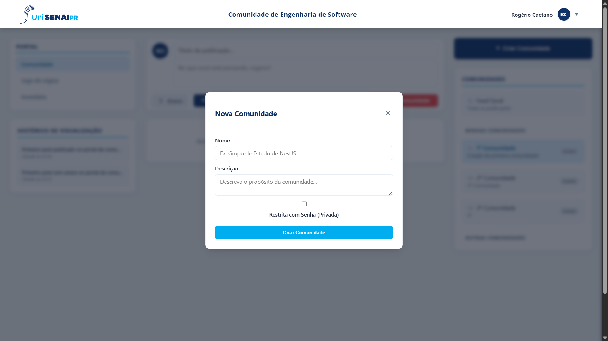
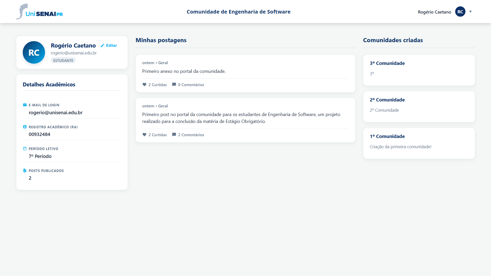
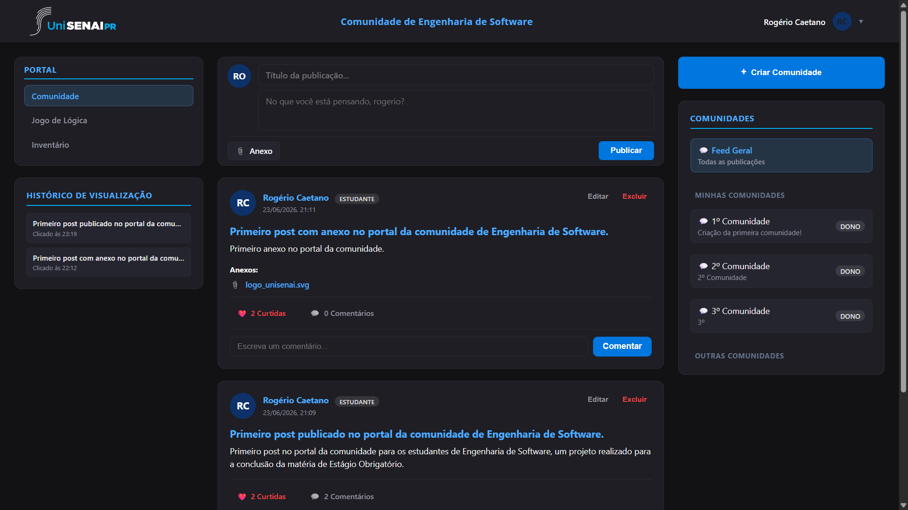
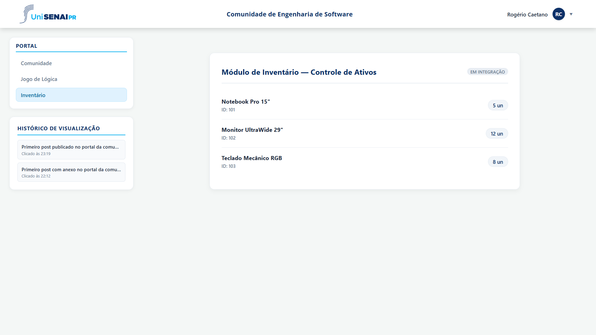
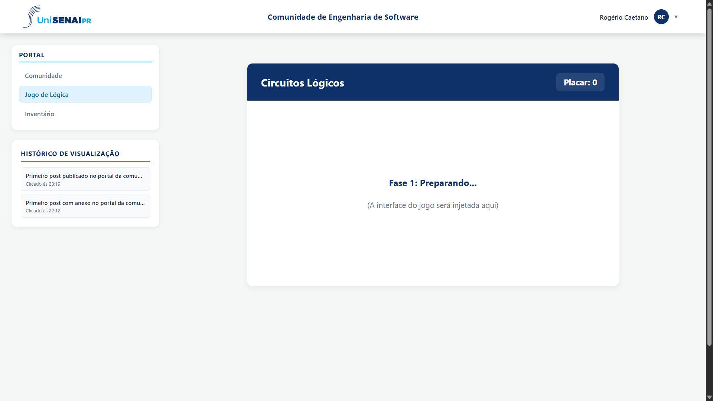

# Projeto Estágio - Microsserviços

Este repositório contém o projeto de estágio, estruturado em arquitetura de microsserviços orientada a eventos, com autenticação centralizada via JWT e front-end baseado em Micro-Frontends.

## Screenshots

> As imagens abaixo representam o estado atual da interface do portal UniSenai PR.

| Tela | Preview |
|------|---------|
| Login / Cadastro |  |
| Feed de Comunidades |  |
| Detalhes da Comunidade |  |
| Nova Comunidade |  |
| Perfil do Usuário |  |
| Tema Escuro |  |
| Gestão de Insumos (Inventário) |  |
| Quiz / Jogo Educativo |  |

## Estrutura do Projeto

A raiz do projeto contém a infraestrutura base (Docker) e as pastas dos microsserviços individuais. Atualmente o ecossistema é composto por:

- `docker-compose.yml`: Arquivo responsável por subir a infraestrutura base (PostgreSQL e RabbitMQ) e os microsserviços.
- `auth-service/`: Microsserviço de autenticação (Produtor) responsável por gerenciar credenciais, perfis e emissão de tokens JWT. Publica eventos de criação de usuário na Exchange `user.events`. Construído com NestJS, Prisma e PostgreSQL.
- `community-service/`: Microsserviço da comunidade (Consumidor) responsável pelo Feed de postagens. Recebe eventos de forma desacoplada e aplica Table Mirroring. Construído com NestJS, Prisma e PostgreSQL.
- `education-service/`: Microsserviço de Ensino/Pedagógico (Consumidor) responsável por cursos, matrículas e avaliações. Consome o evento `user_registered` e espelha os usuários localmente.
- `inventory-service/`: Microsserviço de Gestão de Insumos (Consumidor). Módulo a ser implementado pela equipe responsável, seguindo o contrato de integração documentado.
- `main-shell/`: Application Shell (orquestrador) que carrega os Micro-Frontends de cada módulo.
- `EXTENSIBILIDADE.md`: Documentação técnica detalhando a arquitetura de eventos e o contrato de integração para inclusão de futuros módulos.

## Pré-requisitos

Antes de começar, certifique-se de ter as seguintes ferramentas instaladas em sua máquina:
- [Git](https://git-scm.com/)
- [Node.js](https://nodejs.org/en/) (versão LTS recomendada)
- [Docker](https://www.docker.com/) e [Docker Compose](https://docs.docker.com/compose/)

## Como rodar o projeto localmente

Siga os passos abaixo para configurar e executar o projeto em sua máquina:

### 1. Subindo a Infraestrutura (Banco de Dados e Mensageria)

Abra o terminal na **raiz do projeto** e execute o Docker Compose para iniciar os containers do PostgreSQL e RabbitMQ:

```bash
docker-compose up -d
```
> **Dica:** Para verificar se os serviços estão rodando corretamente, utilize o comando `docker ps`.

### 2. Configurando os Microsserviços

Para cada microsserviço (`auth-service`, `community-service` e `education-service`), abra um terminal distinto e execute os passos de preparação:

#### A. Autenticação (`auth-service`)
```bash
cd auth-service
npm install
cp .env.example .env
npx prisma generate
npx prisma migrate dev
npm run start:dev
```
> **Importante:** O `auth-service` exige a variável `JWT_SECRET` no `.env`. Essa mesma chave deve ser compartilhada com os demais serviços que validarem o token localmente.

#### B. Comunidade (`community-service`)
```bash
cd community-service
npm install
cp .env.example .env
npx prisma generate
npx prisma migrate dev
npm run start:dev
```

#### C. Educação (`education-service`)
```bash
cd education-service
npm install
cp .env.example .env
npx prisma generate
npx prisma migrate dev
npm run start:dev
```

> **Aviso de Banco de Dados:** O `docker-compose` sobe o PostgreSQL na porta `5432`, com usuário `root` e senha `rootpassword`. O `schema` é parametrizado nos arquivos `.env` para garantir o isolamento lógico das tabelas de cada microsserviço dentro do mesmo banco físico (Database per Service).

A aplicação agora estará em execução de forma integrada! As APIs rodam nas portas HTTP `3001` (auth), `3002` (community) e `3003` (education). Testes de API podem ser executados usando o arquivo `api-tests.http` na raiz do projeto.

## Fluxo de Autenticação (JWT)

O `auth-service` centraliza o cadastro e o login dos usuários, emitindo tokens JWT que são validados de forma descentralizada pelos demais módulos.

| Método | Rota | Descrição | Proteção |
|--------|------|-----------|----------|
| `POST` | `/auth/register` | Cadastra um usuário (Student ou Professor) e dispara o evento `user_registered`. | Pública |
| `POST` | `/auth/login` | Valida as credenciais (bcrypt) e retorna `{ access_token, user }`. | Pública |
| `GET`  | `/auth/me` | Retorna os dados extraídos do token (`userId`, `email`, `profileType`). | JWT (Bearer) |

Para acessar rotas protegidas, envie o token no header:
```http
Authorization: Bearer <access_token>
```

## Contrato de Eventos (Integração entre módulos)

O `auth-service` publica o evento `user_registered` na Exchange `user.events` (tipo `fanout`) sempre que um usuário é criado. Qualquer módulo consumidor recebe o evento criando sua própria fila e fazendo o bind nessa Exchange.

```json
{
  "pattern": "user_registered",
  "data": {
    "id": "uuid-do-usuario",
    "email": "usuario@dominio.com",
    "profileType": "student"
  }
}
```

> **Atenção:** o campo `profileType` é sempre enviado em **minúsculas** (`student` ou `professor`). O contrato está tipado em `auth-service/src/events/contracts.ts`. Os detalhes de implementação para cada módulo estão em `EXTENSIBILIDADE.md` e nos READMEs de `education-service` e `inventory-service`.

## Padrões de Projeto & Arquitetura

Para atender aos requisitos de extensibilidade, modularidade e resiliência exigidos, o projeto aplica os seguintes conceitos de Engenharia de Software:

- **Pub/Sub (Publish/Subscribe):** Arquitetura orientada a eventos onde o produtor envia mensagens para uma Exchange `fanout` do RabbitMQ sem saber quem as consumirá. O desacoplamento permite plugar novos microsserviços instantaneamente.
- **Validação Descentralizada de JWT:** A infraestrutura de autenticação baseada em `passport-jwt` (`JwtStrategy` e `JwtAuthGuard`) foi desenhada para ser replicada entre os microsserviços. A validação dos tokens em cada serviço é feita **localmente**, utilizando a chave compartilhada (`JWT_SECRET`) do ambiente, eliminando a necessidade de chamadas síncronas ao `auth-service`.
- **Contrato de Eventos Tipado:** O evento `user_registered` é centralizado e tipado (`UserRegisteredEvent`) com `profileType` padronizado em minúsculas, garantindo um contrato estável e previsível para todos os consumidores.
- **Dead Letter Queue (DLQ) e Resiliência:** Prevenção de perda de dados e tolerância a falhas (ex: indisponibilidade do banco). Mensagens que geram falhas catastróficas (NACK com `requeue: false`) são automaticamente desviadas para a fila `user.events.dlx` de quarentena, prevenindo loops infinitos.
- **Table Mirroring (Espelhamento de Dados):** Cada serviço consumidor salva uma versão leve (espelho) do usuário assim que intercepta o evento assíncrono de criação, garantindo integridade referencial local e alta performance sem precisar consultar o `auth-service` de forma síncrona.
- **Class Table Inheritance (Herança de Dados):** Modelagem de banco de dados mapeando a entidade base `User` em relacionamento `1:1` com as entidades filhas `Student` e `Professor`, unificando o domínio.
- **JSON Field Storage:** Armazenamento semiestruturado em coluna nativa `jsonb` para gerenciar as configurações dinâmicas de perfil sem necessidade de alterações no schema físico do banco.
- **Design Patterns (Strategy & Registry):** Lógica de cálculo dinâmico de limites isolada através do padrão *Strategy* e resolvida em tempo de execução via *Registry*, blindando o núcleo do sistema.
- **Micro-Frontends:** O `main-shell` orquestra interfaces independentes (Web Components / Lit) servidas por cada módulo, permitindo evolução visual desacoplada.

## Integração Contínua (CI)

O repositório possui um workflow de GitHub Actions (`.github/workflows/ci.yml`) com build seletivo por path: ao alterar arquivos de um serviço (`auth-service/**`, `community-service/**` ou `education-service/**`), apenas o job correspondente é executado (instalação de dependências, geração do Prisma Client e build). O `auth-service` possui ainda testes unitários cobrindo os fluxos de cadastro e login.

## Tecnologias Utilizadas

- **[NestJS](https://nestjs.com/)** - Framework Node.js para o backend
- **[Prisma ORM](https://www.prisma.io/)** - ORM para o banco de dados
- **[PostgreSQL](https://www.postgresql.org/)** - Banco de dados relacional
- **[RabbitMQ](https://www.rabbitmq.com/)** - Message Broker para comunicação assíncrona
- **[Passport / JWT](https://docs.nestjs.com/security/authentication)** - Autenticação baseada em tokens
- **[Lit](https://lit.dev/)** - Biblioteca para os Web Components dos Micro-Frontends
- **[Docker](https://www.docker.com/)** - Containerização da infraestrutura
